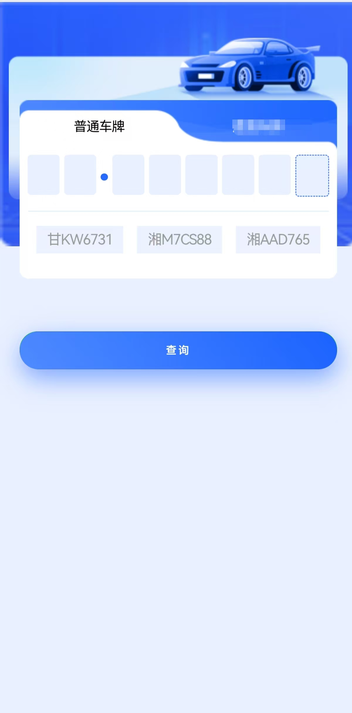
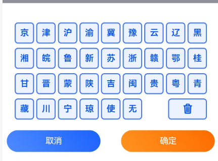
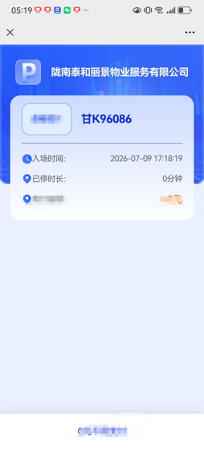
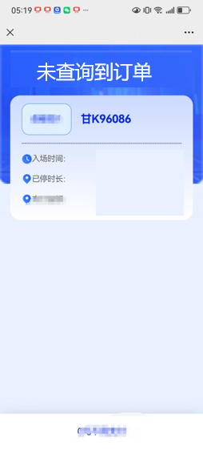

# WZCode

## 一、用户需求

1. 用户通过微信/支付宝扫描二维码。
2. 弹出页面，输入车牌，单击查询，页面刷新当前订单情况。

## 二、逻辑

### 2.1 初始化车场配置

- 只有 [park1]-[park6] 的 park_ukey、park_id 不为空时，才参与数据查询。

### 2.2 查询 UI

- 用户通过微信/支付宝扫描二维码，代云页面如下。



- 键盘参考下图。




### 2.3 结果展示

- 通过车牌查询满足要求的初始化车场，有一个车场查到订单，就结束。
- 有订单展示界面。
- 陇南泰和丽景物业服务有限公司 代表 park_name。
- 甘K96086 代表用户输入的车牌。
- 已停时长 = 当前时间 - 停车云返回的 in_time，单位分钟。



- 未查询到订单界面。



### 2.2.1 3.10 订单查询接口

签名参考 ETC 的签名。

请求 URL:

http://istparking.sciseetech.com/public/order/queryOrder

请求示例:

```json
{
  "service_name": "query_order",
  "sign": "自己计算，参考ETC",
  "park_id": "ini.parkid",
  "data": {
    "car_number": "用户输入的车牌号码"
  }
}
```