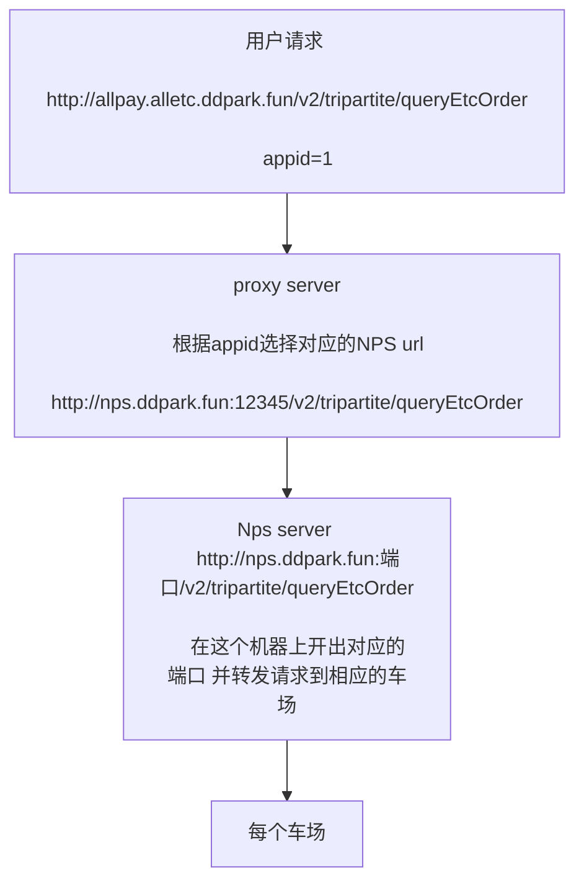

```mermaid

flowchart TD

    A[用户请求 
    http://allpay.alletc.ddpark.fun/v2/tripartite/queryEtcOrder

    appid=1
    ] 

    B[proxy server
    
    根据appid选择对应的NPS url
    http://nps.ddpark.fun:12345/v2/tripartite/queryEtcOrder
    ] 

    C[Nps server 
    http://nps.ddpark.fun:端口/v2/tripartite/queryEtcOrder
    
    在这个机器上开出对应的端口 并转发请求到相应的车场
    ] 

    D[每个车场]


    A --> B --> C --> D
```
